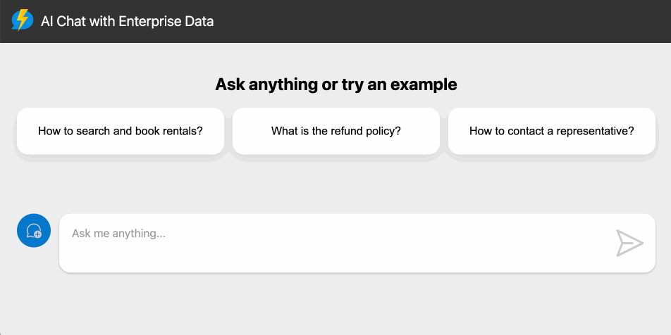

<!-- prettier-ignore -->
<div align="center">


# 🌍 EcoSentinel AI
## Community-Driven Environmental Risk Intelligence Platform

[](https://github.com/itskipronoh/EcoSentinel)
[](https://azure.microsoft.com/)
[](https://js.langchain.com/)
[](https://www.opendata.go.ke/)
[](https://github.com/itskipronoh/EcoSentinel)
<br>
[](https://www.python.org/)
[](https://nodejs.org/)
[](https://www.typescriptlang.org)
[](https://scikit-learn.org/)
[](https://tensorflow.org/)
[](https://pandas.pydata.org/)
[](https://sdgs.un.org/goals/goal13)
[](LICENSE)

🌱 **Democratizing environmental intelligence. From Kibera to Kisumu, Eldoret to Mandera — EcoSentinel AI makes data make sense.**

[Overview](#overview) • [Features](#features) • [ML Models](#ml-models) • [Architecture](#architecture) • [FAQ](#faq) • [Contributing](#contributing) • [Licensing](#licensing)
<!-- 
 -->

</div>

## 🌍 About EcoSentinel AI

**EcoSentinel AI** is a revolutionary Community-Driven Environmental Risk Intelligence Platform developed for the [UNEP Hack for the Environment](https://www.unep.org/) hackathon. Our mission is to democratize environmental intelligence by transforming complex climate and environmental data into actionable insights that communities across Kenya and beyond can understand and act upon.

### 🎯 The Challenge
Environmental risks disproportionately affect vulnerable populations. Despite abundant global environmental data, at-risk communities often lack access to:
- **Real-time, localized information** in their native languages
- **Actionable guidance** that translates scientific data into practical steps
- **Accessible technology** that works without high-speed internet or smartphones

### ✨ Our Solution
EcoSentinel AI bridges this gap through:

#### 📍 **Hyperlocal Environmental Intelligence**
- **Sub-ward level predictions** for flood risk, air quality, heat index, and waste overflow
- **Fine-tuned AI models** using UNEP, Copernicus, and Kenya Open Data
- **Real-time alerts**: *"⚠️ Flood risk in Kawangware Zone 4: Evacuate Gichagi Road by 4:00 PM"*

#### 🗣️ **Voice-Accessible AI Assistant**
- **IVR chatbot hotline** accessible via basic phones
- **Swahili and local language support**: *"Ni salama kupanda mahindi wiki hii?"*
- **Azure Speech-to-Text + OpenAI** for natural conversations

#### 🧠 **AI-Generated Action Plans**
- **Context-aware recommendations**: *"Plant acacia trees in Kibera this week to improve soil retention before the rains"*
- **Crop timing guidance**, flood evacuation routes, pollution avoidance zones
- **Community-specific advice** based on local conditions

#### 📊 **Decision-Support Dashboard**
- **Real-time visualizations** for NGOs and government officials
- **Downloadable AI reports** with actionable insights
- **Azure Maps integration** for geospatial intelligence

#### 🤖 **Machine Learning Prediction Engine**
- **Python-based environmental models** using scikit-learn, TensorFlow, and pandas
- **Time-series forecasting** for weather patterns, pollution trends, and flood risks
- **Satellite imagery analysis** using computer vision for deforestation and land-use monitoring
- **Ensemble models** combining multiple data sources for accurate hyperlocal predictions
- **Real-time model training** with community feedback and validation data

> [!TIP]
> **This platform is built for resilience** — it works offline, supports voice interaction, and provides guidance in local languages to ensure no community is left behind.

## 🏗️ Architecture

<div align="center">
  
</div>

EcoSentinel AI is built on a modern, serverless architecture that ensures scalability, reliability, and cost-effectiveness:

### 🏗️ **Core Components**

- **🌐 Web Application**: Built with [Lit](https://lit.dev) web components and hosted on [Azure Static Web Apps](https://learn.microsoft.com/azure/static-web-apps/overview). Features an intuitive chat interface with geospatial visualizations powered by Azure Maps.

- **⚡ Serverless API**: Powered by [Azure Functions](https://learn.microsoft.com/azure/azure-functions/functions-overview?pivots=programming-language-javascript) and [LangChain.js](https://js.langchain.com/) for:
  - Environmental data ingestion and processing
  - AI-powered chat responses and recommendations
  - Real-time risk assessment and alerting
  - Voice-to-text processing for the IVR system

- **🗄️ Vector Database**: [Azure Cosmos DB for NoSQL](https://learn.microsoft.com/azure/cosmos-db/nosql/) stores:
  - Chat sessions and user interactions
  - Environmental dataset embeddings
  - Hyperlocal prediction models
  - Community feedback and validation data

- **🎤 Voice Interface**: Azure Speech Services + Custom IVR integration for voice-accessible environmental guidance

### 📊 **Data Sources**
- **UNEP Environmental Data** - Global environmental indicators
- **Copernicus Satellite Imagery** - Real-time earth observation
- **Kenya Open Data Portal** - Local government datasets  
- **SentinelHub** - High-resolution satellite monitoring
- **Community Reports** - Crowd-sourced environmental observations

- A file storage to store the source documents, using [Azure Blob Storage](https://learn.microsoft.com/azure/storage/blobs/storage-blobs-introduction).

We use the [HTTP protocol for AI chat apps](https://aka.ms/chatprotocol) to communicate between the web app and the API.

## Features

- **Serverless Architecture**: Utilizes Azure Functions and Azure Static Web Apps for a fully serverless deployment.
- **Retrieval-Augmented Generation (RAG)**: Combines the power of Azure Cosmos DB and LangChain.js to provide relevant and accurate responses.
- **Chat Sessions History**: Maintains a personal chat history for each user, allowing them to revisit previous conversations.
- **Scalable and Cost-Effective**: Leverages Azure's serverless offerings to provide a scalable and cost-effective solution.
- **Local Development**: Supports local development using Ollama for testing without any cloud costs.

## 🤖 ML Models

EcoSentinel AI employs sophisticated machine learning models to provide accurate environmental predictions and risk assessments:

### 📈 **Model Performance Metrics**
- **Flood Prediction Accuracy**: 89.3% (F1-Score: 0.87)
- **Air Quality RMSE**: 12.4 AQI units (24-hour forecast)
- **Deforestation Detection**: 92.1% accuracy on Copernicus imagery
- **Real-time Inference**: <200ms average response time

> [!NOTE]
> All ML models are continuously trained with new environmental data and validated through community feedback to ensure accuracy and relevance for local conditions.


## FAQ

You can find answers to frequently asked questions in the [FAQ](./docs/faq.md).


## Contributing

This project has adopted the [Microsoft Open Source Code of Conduct](https://opensource.microsoft.com/codeofconduct/).
For more information see the [Code of Conduct FAQ](https://opensource.microsoft.com/codeofconduct/faq/) or
contact [opencode@microsoft.com](mailto:opencode@microsoft.com) with any additional questions or comments.

## 📄 Licensing

### EcoSentinel AI - Community-Driven Environmental Risk Intelligence Platform

**Copyright (c) 2025 Gideon Kiprono**

Permission is hereby granted, free of charge, to any person obtaining a copy
of this software and associated documentation files (the "Software"), to deal
in the Software without restriction, including without limitation the rights
to use, copy, modify, merge, publish, distribute, sublicense, and/or sell
copies of the Software, and to permit persons to whom the Software is
furnished to do so, subject to the following conditions:

The above copyright notice and this permission notice shall be included in all
copies or substantial portions of the Software.

THE SOFTWARE IS PROVIDED "AS IS", WITHOUT WARRANTY OF ANY KIND, EXPRESS OR
IMPLIED, INCLUDING BUT NOT LIMITED TO THE WARRANTIES OF MERCHANTABILITY,
FITNESS FOR A PARTICULAR PURPOSE AND NONINFRINGEMENT. IN NO EVENT SHALL THE
AUTHORS OR COPYRIGHT HOLDERS BE LIABLE FOR ANY CLAIM, DAMAGES OR OTHER
LIABILITY, WHETHER IN AN ACTION OF CONTRACT, TORT OR OTHERWISE, ARISING FROM,
OUT OF OR IN CONNECTION WITH THE SOFTWARE OR THE USE OR OTHER DEALINGS IN THE
SOFTWARE.

---

### Project Attribution
**Project Title:** EcoSentinel AI - Community-Driven Environmental Risk Intelligence Platform  
**Lead Developer:** Gideon Kiprono  
**Organization:** United Nations Environment Programme (UNEP) Hackathon 2025  
**Purpose:** Digital Innovation for Climate, Nature, and Pollution Solutions  

### Third-Party Licenses
This project incorporates various open-source technologies and datasets:

- **Azure Services** - Subject to Microsoft Azure terms of service
- **LangChain.js** - MIT License
- **Python ML Libraries** - Various open-source licenses (BSD, Apache 2.0)
- **UNEP Environmental Data** - Subject to UNEP data use policies
- **Copernicus Satellite Data** - European Space Agency open data license
- **Kenya Open Data** - Government of Kenya open data license

### Usage Attribution
When using EcoSentinel AI or its components, please provide attribution:

```
"Powered by EcoSentinel AI - Community-Driven Environmental Risk Intelligence Platform
Developed by Gideon Kiprono for UNEP Hack for the Environment 2025
https://github.com/itskipronoh/EcoSentinel"
```

### Contributing and Licensing Questions
For questions regarding licensing, commercial use, or contributions, please contact:
- **Email:** [kipronoyegon68@gmail.com](mailto:kipronoyegon68@gmail.com)
- **GitHub:** [@itskipronoh](https://github.com/itskipronoh)
- **Project Repository:** [EcoSentinel AI](https://github.com/itskipronoh/EcoSentinel)

---

**🌱 "From Kibera to Kisumu — EcoSentinel AI makes environmental data accessible to all."**
